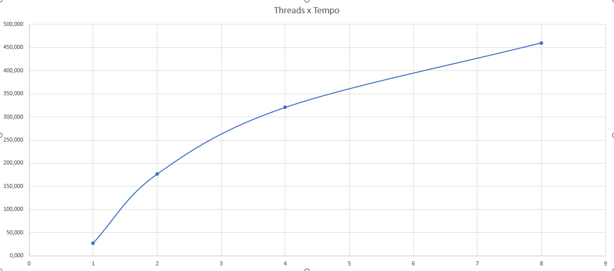

# Trabalho 1 - Ordenador Paralelo

#### Requisitos

- Java 16

#### Execução

Abra o shell na pasta raíz do trabalho e execute os seguintes comandos:

``` 
$ javac *.java
$ java Main
```

#### Resultados

Após executarmos o script 10x para cada instância, observamos que a primeira execução de cada instância levava muito mais tempo do que as outras execuções (da ordem de 100x mais tempo), portanto, para obtenção das médias e desvios padrões, decidimos pro desconsiderar os valores extremos (o menor valor e o maior valor).

| Nº de Threads | Média de Tempo (ms) | Desvio Padrão (ms)
| -- | -- | -- |
| 1 | 27.3750 | 14.7158 |
| 2 | 176.5000 | 10.5153 |
| 4 | 320.5000 | 16.1334 |
| 8 | 460.1250 | 6.9372 |



#### Autores
- <a href="https://github.com/endlichfelipe" target="_blank">Felipe Endlich</a>
- <a href="https://github.com/vitorchane" target="_blank">Vitor Chane</a>